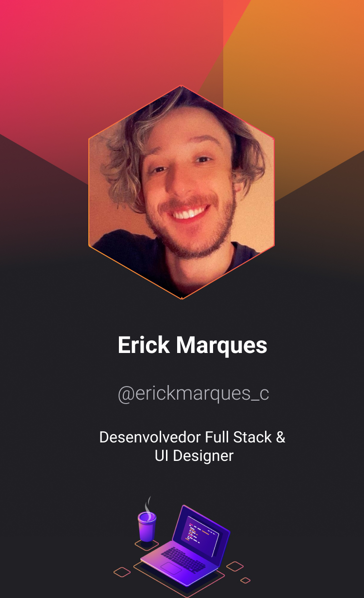

<h3 align="center">I'm Erick Marques Cabral

</h3>
<h3 align="center">A tecnologia será ferramenta de solução da desigualdade.</h3>

 - 📫Morador do Rio de Janeiro
 - ⚡Desenvolvedor fron-end e UI Designer
 - 🤖Movido pela criatividade e a vontade de inovar
 - 👯Procuro me desenvolver de forma multidisciplinar
 - 🔥Sou um profissional apaixonado pela área tecnológica
 - 🔭Guiado pelo desejo de construir experiências significativas
 - 💬Desafios são uma oportunidade de trazer algo de melhor para o mundo

 

